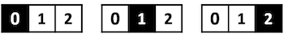
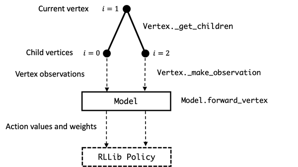

Hallway Environment Example
===========================

The ``graphenv`` library implements graph search as a reinforcement
learning (RL) problem with parameteric action spaces, and is ready to
use with many off-the-shelf algorithms avaialable in the RLLib
framework.

Before jumping into the implementation details, let’s take a look a
simple motivating example: the hallway problem.

The hallway problem is effectively a 1d version of the gridworld problem
in classic RL. We are given a hallway with :math:`N` discrete positions
and, starting at one end, want to learn to reach the opposite end in as
few steps as possible.

   hallway-flat

The figure above shows a hallway problem with :math:`N=3`, and the
optimal solution starting at state 0 and ending at state 2, with each
“current state” highlighted in black.

This trivial problem can be used to express the “RL on a graph” idea
succinctly, and enable solving much more interesting, non-trivial
problems.

The hallway problem as graph problem
------------------------------------

Before we jump into the graph formulation of the hallway problem, let’s
talk first about *actions*, because this is one of the key differences
between ``graphenv`` and traditional RL gym environments.

Typically, discrete actions spaces in gym environments have fixed
dimension and fixed definitions. In the hallway problem, for instance,
there are always two actions: “move left” (action=0) and “move right”
(action=1). Cases where the action is infeasible, like trying to move
left from the start position, are typically handled by implmenting a
*null* transition where the action doesn’t change the current state.

In general graph search problems, however, such fixed action spaces are
not practical. In the game of chess, for example, the total number of
possible board states and, subsequently, moves, is astronomical, while
the set of *feasible* moves changes continually throughout the game.

The key observation that makes graph search tractable as a gym
environment is: even for large and complex graph search problems, the
number of states that are accessible from the current state is usually
relatively small. If, instead of fixing the action to a pre-defined set
of choices, we think of each action as representing an accessible next
state, this endeavor becomes tractable.

And so, we abandon the idea of “fixed” action spaces in favor of
“parametric” action spaces. Here, **parametric** means that actions
coincide with next states represented by feature vectors, rather than
having a single, index-based interpretation. In other words, rather than
actions as “move :math:`[ left, right ]`”, parametric actions can be
thought of as “go to state :math:`[i, j]`” where the states :math:`i,j`
each have a vector representation. Also unliked fixed spaces, the order
doesn’t matter: we could equivalently say “go to state :math:`[j, i]`”.

A key ingredient in making this machinery work is to have policy models
that can work on parameteric action spaces

The figure below illustrates how to think of the simple hallway example
as a graph problem.

.. figure:: ./img/hallway-graph.png
   :alt: hallway-graph

   hallway-graph

Before jumping into the specifics of how all of this works in
``graphenv``, let’s define some terms.

A **vertex** reprents a single state in the graph which, for this
problem, can be described by an index :math:`i\in \{ 0, 1, 2 \}`.
(Sometimes we’ll use the terms vertex, state, and node interchangeably).
In the figure, each vertex is shown alongside the corresponding state of
the hallway problem.

The **root** is the starting vertex of the graph search, here,
:math:`i=0`.

At each state in the search, a certain number of child states (or
**children**) are accessible. In the figure above, we illustrate this
using the color codes:

-  black = current vertex
-  white = child vertex
-  gray = inaccessible, or **masked**, vertex

If we think of an RL action as selecting one of these children, it’s
clear that the number of actions can change from one state to the next.
For example:

-  Starting at the root vertex :math:`i=0` (black), state :math:`i=1`
   (white) is accessible by moving right, while state :math:`i=2` (gray)
   can’t be accessed in a single move.
-  Starting at vertex :math:`i=1` (black), both :math:`i=0` and
   :math:`i=2` are accessible (white) – there are no masked states in
   this case.

The **terminal** vertex here coincides with :math:`i=2`. Notice that
this vertex has no children because, when reached, the problem is
solved.

The hallway problem as graphenv problem
=======================================

The graphenv module makes it easy for a user to implement their graph
search problem as a gym environment, and then to plug that environment
into RLLib using both custom and off-the-shelf RL algorithm. At a high
level, the user implements a ``Vertex`` and ``Model`` class to represent
the graph state and correspnding RL policy model and graphenv takes care
of the rest.

The figure highlights below illustrates how the ``Vertex`` and ``Model``
classes interact, with data labeled on the left and associated methods
labeled on the right.

   graphenv

Below, we step through the implementation of the ``HallwayState``
(inheriting from the graphenv ``Vertex``) and ``HallwayModel``
(inheriting from the graphenv ``Model``). We then provide a working
example of building and running a hallway environment.

HallwayState
------------

(See ``graphenv.examples.hallway.hallway_state`` for the full
implementation).

The ``HallwayState`` represents all of the problem logic at the level of
a single vertex that enables graphenv to automate the overarching search
and RL training. This class inherits from ``graphenv.vertex.Vertex``
which has a number of required methods and attributes which we step
through below.

``__init__``
~~~~~~~~~~~~

As you’d expect, problem configuration happens here. The hallway state
is completely specified by the current and end positions,

.. code:: python

   def __init__(
           self,
           corridor_length: int,
           cur_pos: int = 0,
       ) -> None:
           """Initializes this HallwayState.
           Args:
               corridor_length (int): length of the vertex chain
               cur_pos (int, optional): initial vertex index. Defaults to 0.
           """
           super().__init__()
           self.end_pos = corridor_length
           self.cur_pos = cur_pos

``observation_space``
~~~~~~~~~~~~~~~~~~~~~

Returns a ``gym.spaces.Space`` object that describes the structure of
the data used to represent a vertex. In the hallway problem,

.. code:: python

   @property
   def observation_space(self) -> gym.spaces.Dict:
       """HallwayStates are observed with a dictionary containing a single
       key, 'cur_pos', with an integer value between 0 and self.end_pos,
       indicating the index of the vertex.
       Returns:
           gym.spaces.Dict: The observation space for HallwayStates.
       """
       return gym.spaces.Dict(
           {
               "cur_pos": gym.spaces.Box(
                   low=np.array([0]), high=np.array([self.end_pos]), dtype=int
               ),
           }
       )

where ``cur_pos`` is the integer index of the current position. The box
space has a single element containing the index of the current position
but, in general, can contain multiple, complex subspaces.

``new``
~~~~~~~

Returns a new vertex instance with updated state. For the hallway
problem,

.. code:: python

   def new(self, cur_pos: int):
       """Convenience function for duplicating the existing node.
       Returns:
           HallwayState : a copy of this HallwayState.
       """
       return HallwayState(self.end_pos, cur_pos)

where ``cur_pos`` is the position of the new state.

``root``
~~~~~~~~

Returns the root vertex. In the hallway problem, we always go back to
state 0,

.. code:: python

   @property
   def root(self) -> "HallwayState":
       """
       Returns:
           HallwayState: initial state (vertex at index 0)
       """
       return self.new(0)

``reward``
~~~~~~~~~~

Returns the vertex reward. For the hallway problem, we give a small
negative reward for each non-terminal step, and a random, positive
reward for reaching the goal.

.. code:: python

   @property
   def reward(self) -> float:
       """The reward function for the HallwayState graph.
       Returns:
           float: random reward between 0 and 2 on the goal vertex, -0.1
               otherwise.
       """
       return random.random() * 2 if self.cur_pos >= self.end_pos else -0.1

``_get_children``
~~~~~~~~~~~~~~~~~

To take an action from a given vertex in the graph search, we need to be
able observe its children. The ``Vertex`` class implements this first
part through a ``_get_children`` generator which, for the hallway
problem, looks like:

.. code:: python

   def _get_children(self) -> Sequence["HallwayState"]:
       """Gets child verticies of this vertex. Each vertex has both larger
       and smaller adjacent index verticies as children, except for the initial
       and goal verticies.
       Yields:
           HallwayState: Child verticies of this vertex.
       """
       if self.cur_pos < self.end_pos:
           if self.cur_pos > 0:  # Stop the hallway from going negative
               yield self.new(self.cur_pos - 1)
           yield self.new(self.cur_pos + 1)

where the ``new`` methods simply returns a new instance with updated
state index.

In our example above, this method will yield

::

   * [new(1)] if cur_pos == 0
   * [new(0), new(2)] if cur_pos == 1
   * [] if cur_pos == 2

Note that the number of children (actions) is variable, and that the
terminal state returns an empty list of next children.

``_make_observation``
~~~~~~~~~~~~~~~~~~~~~

To decide which child to transition to, the RL agent will need to call a
policy model with that vertex’s observation. To this end, we implement
``_make_observation`` which, for the hallway example, returns:

.. code:: python

   def _make_observation(self) -> Dict[str, np.ndarray]:
       """Makes an observation of this HallwayState vertex.
       Returns:
           Dict[str, np.ndarray]: dictionary containing the current position
           index under the key 'cur_pos'.
       """
       return {
           "cur_pos": np.array([self.cur_pos], dtype=int),
       }

Note that the returned observation must exactly match the specification
in the vertex’s ``observation_space``.

HallwayModel
------------

(See ``graphenv.examples.hallway.hallway_model`` for the full
implementation).

The ``Model`` class implements the policy model used by the RL algorithm
and, as such, needs to be implemented to take vertex observation data as
input, and to output an action value and action weight for each
observation. In practice, this amounts to implementing a keras model in
the ``__init__``, and storing it in the ``base_model`` attribute of the
model class.

.. code:: python

   class HallwayModel(GraphModel):
       """An example GraphModel implementation for the HallwayEnv and HallwayState
       Graph.
       Attributes:
           base_model : The Keras model used to evaluate vertex observations.
       """

       def __init__(
           self,
           *args,
           hidden_dim: int = 1,
           **kwargs,
       ):
           """Initializs this HallwayModel.
           Uses a dense fully connected Keras network.
           Args:
               hidden_dim (int, optional): The number of hidden layers to use. 
                   Defaults to 1.
           """
           super().__init__(*args, **kwargs)

           cur_pos = layers.Input(shape=(1,), name="cur_pos", dtype=tf.float32)

           hidden_layer = layers.Dense(hidden_dim, name="hidden_layer")
           action_value_output = layers.Dense(
               1, name="action_value_output", bias_initializer="ones"
           )
           action_weight_output = layers.Dense(
               1, name="action_weight_output", bias_initializer="ones"
           )

           out = hidden_layer(cur_pos)
           action_values = action_value_output(out)
           action_weights = action_weight_output(out)

           self.base_model = tf.keras.Model(
               [cur_pos], [action_values, action_weights])

HallwayEnv
----------

TODO: HERE

